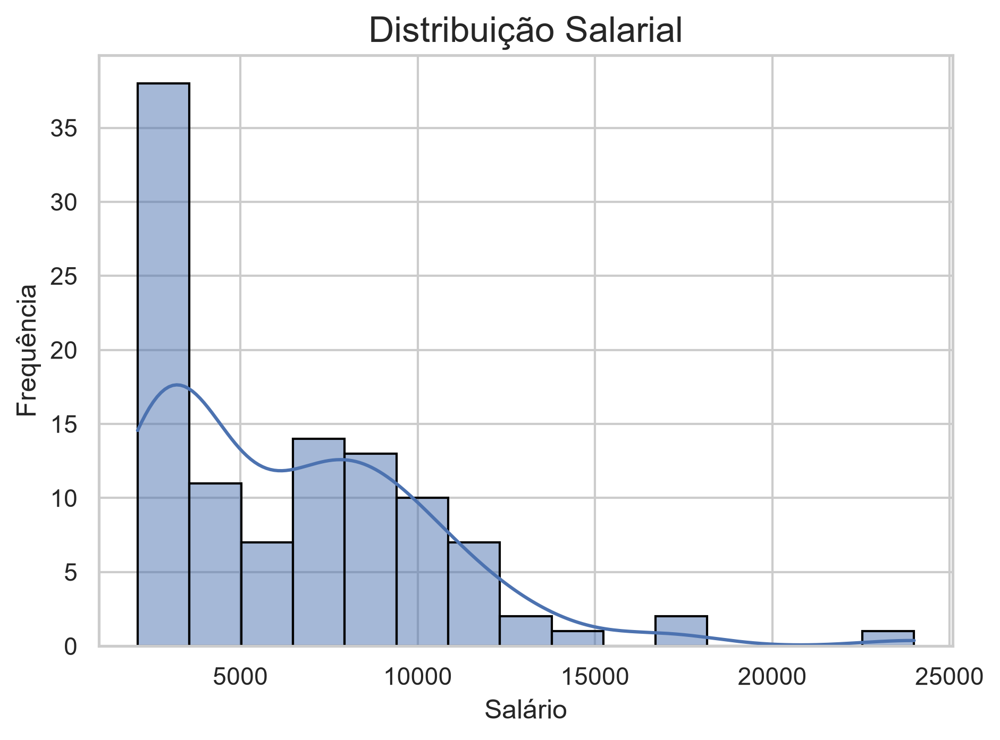
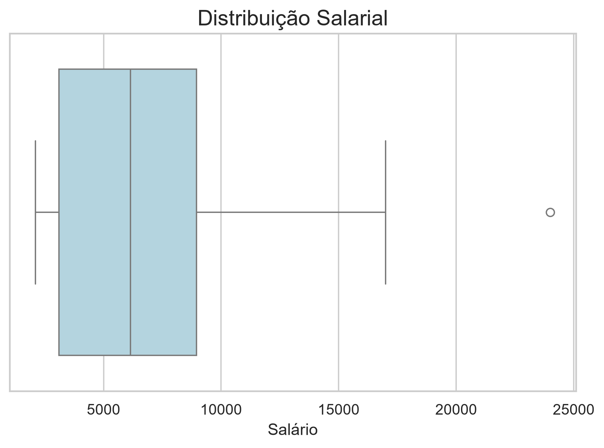
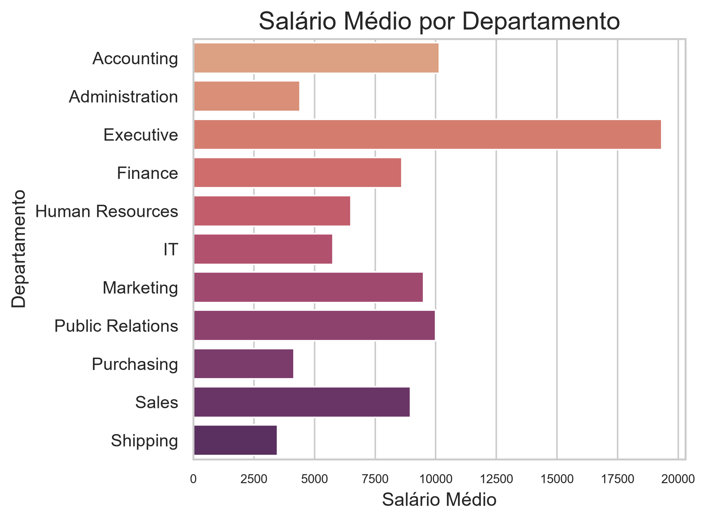
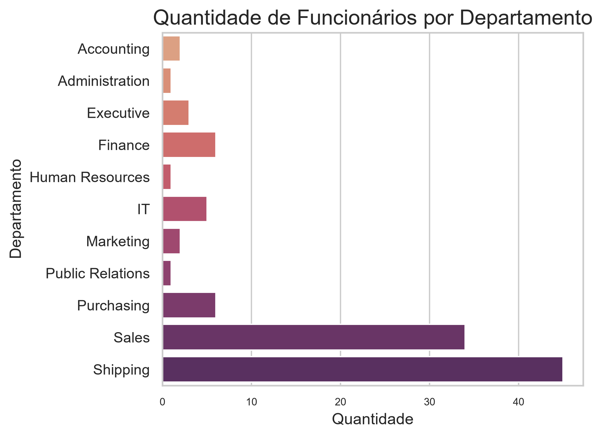
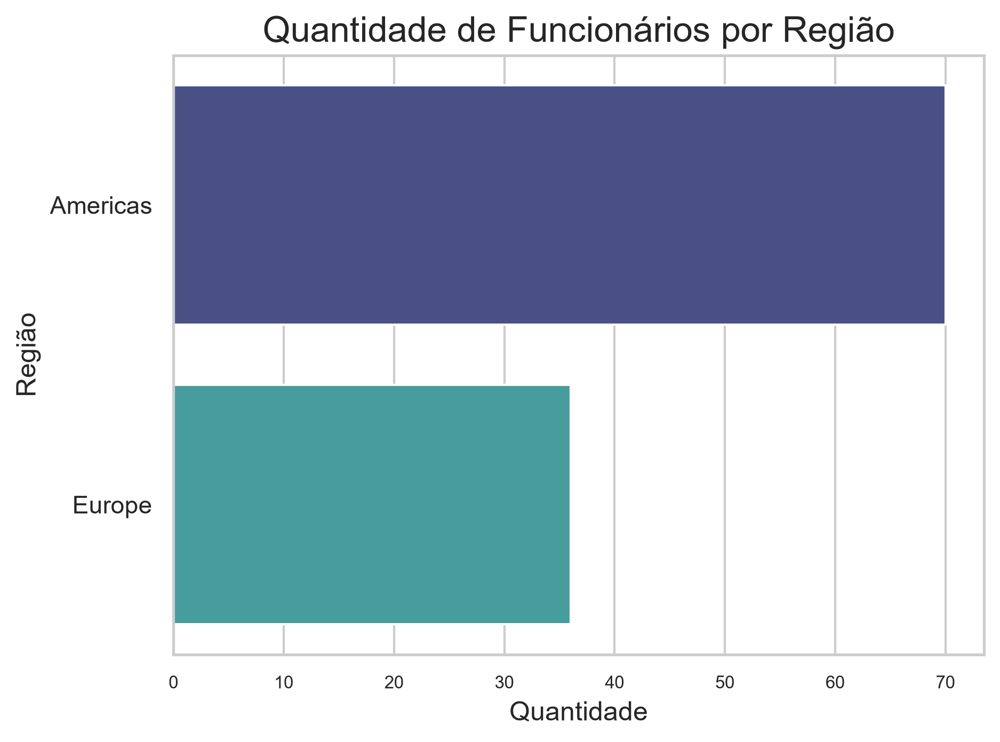
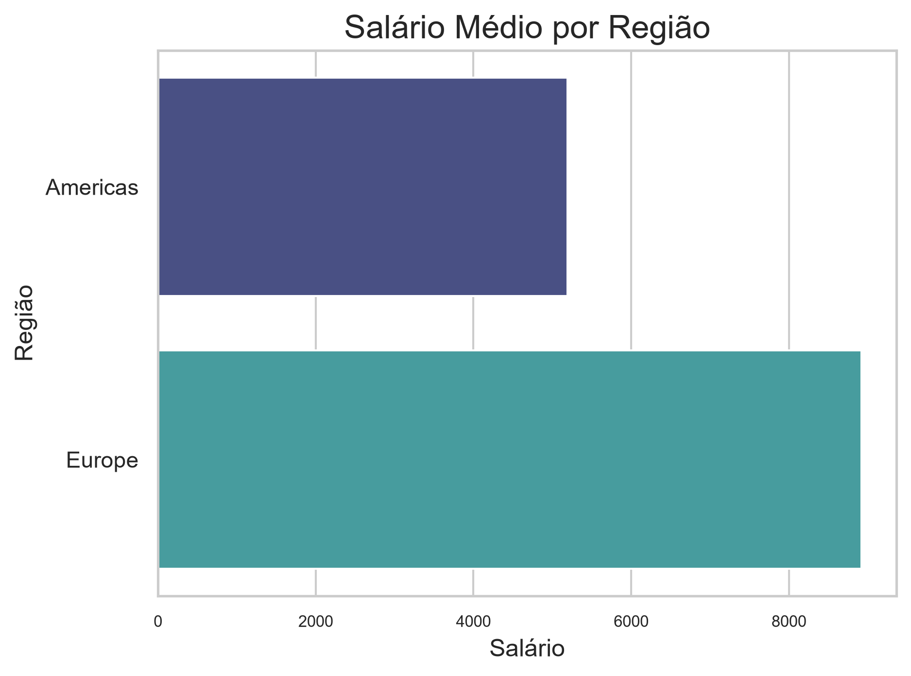
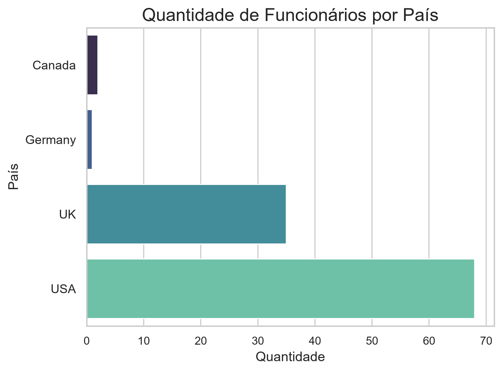
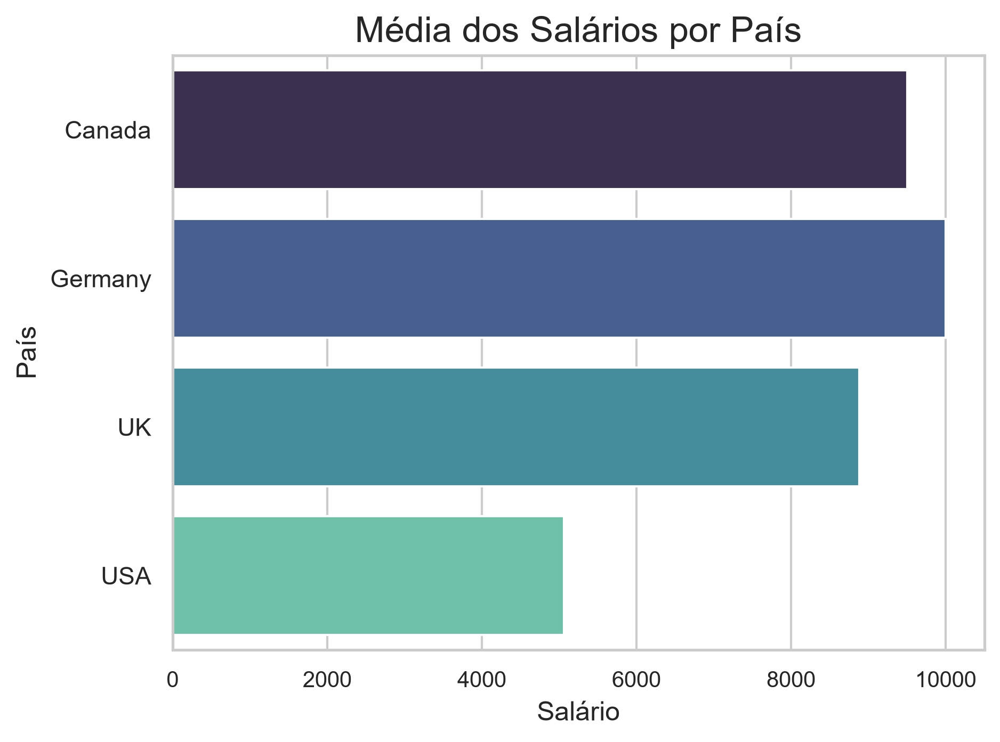
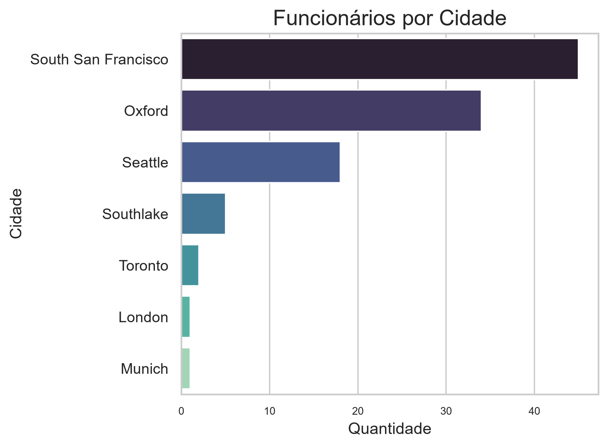

# 📊 Projeto RH - Análise de Dados com SQL e Python


## 👨‍🎓 Aluno

**Nome:** Lourenço Lemos

**Turma:** 2

---

# 🎯 Objetivo do Projeto

Este projeto tem como objetivo aplicar conceitos de SQL, Python e Análise Exploratória de Dados (EDA) utilizando a base de dados HR da Oracle.

Foram desenvolvidas consultas SQL para extração e relacionamento dos dados, seguidas de análises estatísticas e visualizações gráficas em Python, permitindo identificar padrões relacionados à distribuição salarial, departamentos e localização geográfica dos colaboradores.

---

# 🛠 Tecnologias Utilizadas

- Oracle SQL
- Python
- Pandas
- Matplotlib
- Seaborn
- Jupyter Notebook
- Git
- GitHub

---

# 📂 Estrutura do Projeto

```text
projeto-rh-sql-python/
│
├── data/
│   ├── raw_data/
│   └── processed_data/
│
├── sql/
│   ├── query_01.sql
│   └── query_02.sql
│
├── notebooks/
│   └── analise_rh.ipynb
│
├── images/
│
├── README.md
├── requirements.txt
└── .gitignore
```

---

# 🗄 Base de Dados

O projeto utiliza o esquema **HR (Human Resources)** da Oracle.

As principais tabelas utilizadas foram:

| Tabela | Descrição |
|---------|-----------|
| EMPLOYEES | Informações dos funcionários |
| JOBS | Cargos e faixas salariais |
| DEPARTMENTS | Departamentos |
| LOCATIONS | Localização dos departamentos |
| COUNTRIES | Países |
| REGIONS | Regiões geográficas |

---

# 🔍 Consulta SQL 01

### Objetivo

Relacionar funcionários, departamentos e cargos para realizar a análise da distribuição salarial.

### Informações obtidas

- Funcionário
- Salário
- Cargo
- Departamento
- Faixa salarial do cargo

---

# 📈 Análise da Query 01

Foram realizadas:

- Estatísticas descritivas
- Histograma da distribuição salarial
- Boxplot
- Salário médio por departamento
- Quantidade de funcionários por departamento

## Distribuição Salarial



A distribuição salarial apresenta assimetria, com uma maior concentração de colaboradores nas faixas salariais mais baixas e uma redução gradual da quantidade de colaboradores à medida que os salários aumentam. 

Esse comportamento é esperado, já que a base de dados reflete os salários de uma empresa, e nessas estruturas é normal que poucos cargos de liderança concentrem salários significativamente superiores à média.

---

## Boxplot



O boxplot confirma a assimetria na distribuição salarial, evidenciando um outlier que corresponde ao maior salário da empresa. 

Esse valor representa um cargo executivo, não caracterizando assim um erro nos dados, mas sim uma característica da empresa. 

A maior parte dos salários concentra-se em uma faixa relativamente menor quando comparada ao valor máximo observado.

---

## Salário Médio por Departamento



É possível observar uma diferença grande entre as médias salariais de cada departamento.

A áreas de executivos apresenta salário médio superior aos departamentos operacionais e administrativos. 

Essa diferença pode ser entendida como um reflexo da complexidade das atividades realizadas em cada área da empresa.

---

## Quantidade de Funcionários



A distribuição dos colaboradores entre os departamentos demonstra que a força de trabalho da empresa está concentrada nas áreas de venda e logística. 

Já em departamentos estratégicos e executivos, como relações públicas e recursos humanos, o número de funcionários é bem menor, demonstrando uma estrutura padrão de empresas de médio e grande porte.

## Conclusão da Query 1

A análise dos dados salariais permitiu perceber que há uma distribuição assimétrica das remunerações, com predominância de salários mais baixos e poucos funcionários com cargos de alta remuneração.

Além disso, foi possível observar que departamentos executivos concentram os maiores salários médios, enquanto as áreas operacionais tem a maior quantidade de colaboradores. 

Esses resultados demonstram que a empresa analisada possui uma estrutura organizacional padrão para uma empresa multinacional.

---

# 🌍 Consulta SQL 02

### Objetivo

Relacionar funcionários com departamentos, cidades, países e regiões para realizar uma análise geográfica da empresa.

### Informações obtidas

- Funcionário
- Salário
- Departamento
- Cidade
- País
- Região

---

# 📊 Análise da Query 02

Foram desenvolvidos gráficos para analisar:

- Funcionários por região
- Salário médio por região
- Funcionários por país
- Salário médio por país
- Top cidades com maior quantidade de funcionários

## Funcionários por Região



O gráfico de distribuição de colaboradores por regiões demonstra que a empresa concentra a maior parte de sua força de trabalho na América, o que pode indicar maior presença operacional nesse mercado.
 
O gráfico demonstra uma presença de funcionários bem menor na Europa, sugerindo operações menores ou escritórios regionais.

---

## Salário Médio por Região



Esse gráfico nos permite vizualizar que há uma diferença de média salarial grande entre a Europa e a América, sendo a média salarial europeia quase o dobro da média na América. 

Não é possível determinar uma causa somente analisando esse gráfico, já que essa variação pode estar relacionada ao custo de vida de cada região, às políticas salariais locais ou ao perfil dos cargos existentes em cada região.

---

## Funcionários por País



Os Estados Unidos concentram a maior parte dos colaboradores da base analisada, enquanto países como Reino Unido, Canadá e Alemanha apresentam equipes significativamente menores. 

Esse resultado reforça a noção de que os Estados Unidos são o principal mercado e centro operacional da empresa.

---

## Salário Médio por País



A remuneração média varia entre os países analisados, indicando diferenças nas estruturas organizacionais e também a possibilidade de políticas de remuneração diferentes. 

Essas diferenças podem refletir tanto características econômicas locais quanto a distribuição de cargos de maior responsabilidade em determinados países. A Alemanha, por exemplo, e o país com menor número de funcionários, mas é o país com a maior média salarial, o que indica que os funcionários alocados nesse lugar devem ter cargos mais altos.

---

## Top Cidades



A concentração dos colaboradores em poucas cidades, uma nos EUA e outra no Reino Unido, mostra a existência de polos administrativos e operacionais. 

Essa distribuição pode auxiliar na definição de estratégias relacionadas à gestão de pessoas, expansão das operações e alocação de recursos..

## Conclusão da Query 2

A análise geográfica mostrou que a empresa possui maior concentração de colaboradores nos Estados Unidos, seguido do Reino Unido, tanto em número de funcionários quanto na distribuição das operações. 

Também foram observadas diferenças salariais entre países e regiões, indicando que fatores geográficos influenciam a composição da força de trabalho e a política de remuneração da organização.
---

# 💡 Principais Resultados

A análise permitiu identificar que:

- A distribuição salarial é assimétrica.
- Poucos colaboradores concentram os maiores salários.
- Os departamentos executivos apresentam maior remuneração média.
- A maior parte dos funcionários está concentrada nos Estados Unidos.
- Existem diferenças salariais grandes entre regiões e países.
- A estrutura da empresa apresenta características típicas de uma organização multinacional.

## Conclusão Geral do Projeto

Este projeto permitiu que eu unisse SQL, Python e análise exploratória de dados para analisar informações da base HR da Oracle. Inicialmente, usei consultas SQL para extrair e relacionar dados de funcionários, salários, cargos, departamentos e localização geográfica. Em seguida, utilizei a biblioteca Pandas para tratamento e análise dos dados, e as bibliotecas Matplotlib e Seaborn para a construção das visualizações.

As análises demonstraram uma distribuição salarial assimétrica, característica de empresas com hierarquas bem definidas, além de evidenciar diferenças de remuneração entre departamentos, países e regiões. Foi possíve identificar que a força de trabalho se concentra em determinados departamentos e localidades, demonstrando assim uma visão da estrutura da empresa.

O projeto demonstrou a importância da combinação entre consultas SQL e ferramentas de análise em Python para transformar dados brutos em informações relevantes para a tomada de decisão, práticas fundamentais de análise de dados e Business Intelligence.
---

# ▶ Como Executar

1. Clone o repositório

```bash
git clone <https://github.com/lourencolemos/projeto-rh-sql-python>
```

2. Instale as dependências

```bash
pip install -r requirements.txt
```

3. Execute as consultas SQL na base HR Oracle.

4. Abra o notebook:

```text
notebooks/analise_rh.ipynb
```

5. Execute todas as células.

---

# 🚀 Melhorias Futuras

Como evolução deste projeto, podem ser implementadas as seguintes melhorias:

- Dashboard interativo em Power BI.
- Filtros dinâmicos.
- Comparação salarial por cargo.
- Indicadores de Recursos Humanos (KPIs).

---

# 👤 Autor

**Lourenço Lemos**

Projeto desenvolvido como atividade prática da disciplina de Análise de Dados da SCTEC.
